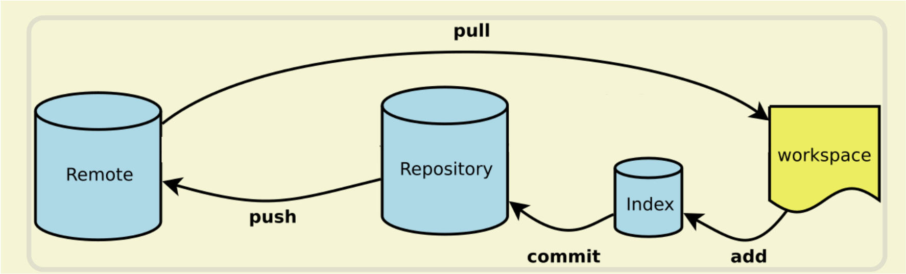

# 使用Github仓库

GitHub是一个很强大线上仓库，本篇笔记记录新手小白从零开始使用GitHub的经历。

***本篇笔记参考网站：***
https://www.cnblogs.com/wangcuican/p/12522239.html
https://www.ruanyifeng.com/blog/2015/12/git-cheat-sheet.html

### 基本概念

先介绍几个基础概念便于理解，本地代码提交到GitHub远程是途经多个站点，不是一蹴而就的。

1. **Workspac**: 本地代码文件夹，*起点*
2. **Stage/Index**: 暂存区，想象成一个中转站
3. **Repository**: git为代码文件夹创建的本地仓库区
4. **Remote**: GitHub远程仓库，*终点*

### git实现 (在这操作之前，你需要安装git客户端，如有需要自行百度安装)
了解流程后我们再来看每一步是怎么实现的的。

0. 首先要做的是，将本地代码文件夹初始化成git仓库，在本地为代码文件夹创建一个仓库区
   终端到代码文件夹下运行 `git init`
   创建成功后，文件夹会变色，绿色代表新建的文件夹，同时代码文件夹下也会出现 *.git* 文件夹（mac `command + shift + .`打开隐藏文件）
   
1. 接下来代码就开始旅行了，**第一步**放入暂存区
   `git add .` 要注意*add*后跟一个space, 这行代码运行后没有任何输出
   但可以`git status`查看更新的文件
   
2. **第二步**将暂存区的文件提交到本地仓库
   `git commit -m '提交信息'`
3. **第三步**将本地文件提交到远程GitHub
   - 但如果是第一次提交，还需要以下步骤：
     1）到GitHub上创建一个仓库
     
     2）新创建的项目会给一些信息，拿到SSH
     
    3）把刚刚GitHub教程中的代码`git remote add origin git@github.com:HiiSong/Notes.git `拷贝到命令行中运行，没有输出
    4）提交`git push -u origin master`,这里要注意，原本教程中给的是*main*,我运行报错，改为*master*后成功。暂时不清楚原因
    

### tips
1. 核心步骤就上面的，第一次提交之后的每次提交，只需要：`git add .` -> `git commit -m '提交信息'` -> `git push -u origin`
2. 如果有需要，`rm -rf .git`可以把本地仓库 *.git* 文件夹删除重新 `git init`新建从头开始，有时候对于新手来说步骤混乱把自己弄晕了还不如从头来。
3. 如果push的时候遇到报错说哪个文件有问题，可以在缓存区移除报错文件 `git rm --cached 文件名`，终端没有输出，但项目文件的颜色会发生改变
4. 上面第一步的图我们看到 .DS_Store也被提交了，有时候一些文件大，也不适合提交。因此我们希望提交代码的时候自动忽略一些文件，需要用到 ***.gitignore***文件。
   - 在根目录创建`.gitignore`文件,
   - 然后直接把要忽略的文件名填进去，Git就会自动忽略这些文件。
  语法参考：https://www.jianshu.com/p/ea6341224e89
5. 为了避免提交时和remote的冲突，提交之前要先g`git fetch`
   

### 待续...
