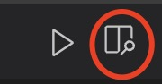

#vscode写markdown

Wellcome to my first note, this note is about how to create markdown note using vscode platform.

I will write down import tips.


1. 实现同步预览。
   1）安装插件 Markdown Preview Github Stying
   2) 点击右上角“run code”按钮旁边的 “MPE:打开侧边预览”
   

2. 基本语法
   1) 标题：使用“#”，1-6级标题
   2) 正文：直接输入
   3) 换行：空一行
   4) 代码块：
   ```
   code 
   block
   ``` 
   5) 正文中的代码：`code line`
   6) 有序列表：1. xxx, 换行自动增加号码
   7) 无序列表：内容前面加短横线并空格 - xxxx
   8) 加粗：**加粗**，倾斜：*倾斜*，加粗并倾斜：***加粗并倾斜***
   9)  插入图片：，但要注意都要是英文符号